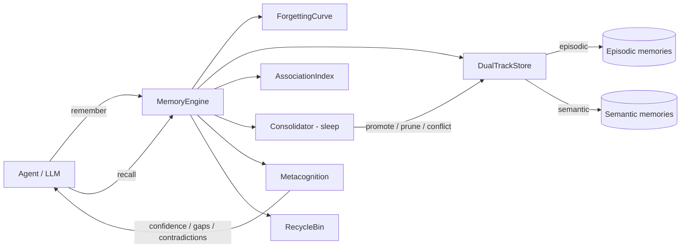

# Mnemosis

> 把 AI 的记忆，从“无限存储 + 搜索”改造成“会记住、会遗忘、会整理、会自我怀疑”的系统。

Mnemosis is a **human-inspired memory layer for AI agents**. Most "AI memory"
systems today are just storage with semantic search bolted on: they save
everything and recall by similarity. Mnemosis instead treats memory as a
**lifecycle** — remembering, reinforcing, consolidating, forgetting, and
reconciling — the way human memory actually works.

- **Dual-track memory** — episodic ("what happened") and semantic ("what is
  true") are stored and recalled separately.
- **Forgetting curve** — memories decay with time; access and review
  strengthen them (Ebbinghaus + spaced repetition).
- **Sleep consolidation** — an offline pass promotes repeated experiences into
  stable knowledge, prunes noise, and detects contradictions.
- **Source monitoring** — every memory keeps its origin, timestamp, trust, and
  confidence, so the system can say "I'm not sure" instead of confabulating.
- **Active forgetting** — unimportant memories fade; deletions go to a
  recyclable trash, never silently.
- **Metacognition** — confidence labels, contradiction reports, and knowledge
  gaps before the agent answers.
- **Associative recall** — memories are indexed by multiple cues (time, topic,
  people, keywords) and linked, so any angle can reach them.
- **Pattern completion** - a partial cue re-activates a whole well-integrated
  pattern: weakly retrievable memories that are strongly linked to a partial
  match get a bounded completion boost (Rolls, 2013; Theves et al., 2024).
- **Confidence calibration** - stated confidence is blended with each
  memory's real retrieval hit rate, so "I'm sure" tracks "I'm actually
  right" (Lichtenstein et al., 1977).
- **Confidence-aware review** - a successful review of a memory the system
  is unsure about keeps the next interval shorter (more practice), the
  scheduling face of desirable difficulty (Bjork & Kroll, 2015).
- **Chinese-optimized retrieval** - CJK stopword filtering, zh date
  normalization ("2026年3月1日" / "2026年五月二日" <-> "2026-03-02") and
  precise date+person event anchoring; verified at 10k-memory zh scale
  (total hit@5 50.3% -> 98.8%).
- **Context-dependent recall** — memories keep the context they were formed
  in, and recall boosts context matches (Godden & Baddeley, 1975).
- **Emotional persistence** — affect-tagged memories decay more slowly
  (Cahill & McGaugh, 1998).
- **Evidence accumulation** — repeated episodes consolidate into semantic
  facts whose confidence grows with supporting evidence (complementary
  learning systems; McClelland et al., 1995).
- **Blocking detection** — when cues match but recall fails, Mnemosis reports
  the "blocked" memories so the agent can try another route (Schacter, 1999).
- **Storage vs retrieval strength** — retrieval strength decays fast, while
  storage strength accrues slowly and durably (Bjork & Bjork, 1992).
- **Automatic cue extraction** — content is indexed with multiple retrieval
  routes at encoding time (encoding specificity; Tulving & Thomson, 1973).
- **Memory updating** — `update()` revises facts, tracks revisions, and
  destabilizes the trace before it re-stabilizes (Nader et al., 2000).
- **Working set** — recently used memories are exposed for prompt injection
  (Atkinson & Shiffrin, 1968; CoALA).
- **Synonym-tolerant semantic recall** — optional zero-dependency
  `NGramEmbedder` (or any external embedding callable) blends semantic
  similarity into scoring, so "preference" still matches "prefers" and
  "color" matches "colour".
- **Local-first, zero runtime dependencies** — pure Python `stdlib`, SQLite
  persistence, no server, no mandatory cloud embeddings (optional embedder
  hooks).

- **Event-chain schema recall** ??episodes sharing a person + session are
  ordered by date and linked to their successor, so "after X, what
  happened?" is answered by following the chain (Gilboa & Marlatte, 2017).
- **Action-cued episodic preference** ??temporal questions ("after/next/then")
  give episodic memories a small preference, so the event anchor is not
  outranked by a same-keyword fact.
- **Spaced-repetition feedback loop** ??`review_due()` + `review()` let the
  agent judge recall success; streaks grow intervals, failures reset them
  (Smolen et al., 2016). Measured: after 4 weeks, reviewed memories 10/30
  remain retrievable vs 0/30 without review.
- **Sleep dedup** ??near-identical repeated episodes collapse into one trace
  with accumulated evidence (complementary learning systems; McClelland et
  al., 1995). Measured: 20 identical repeats -> 1 memory (-95% storage).
- **Hallucination guard** ??metacognition reports knowledge gaps for
  never-seen topics instead of confabulating.

## Why another memory project?

The space is crowded (Mem0, Letta/MemGPT, Zep, Cognee, `cognitive-memory`,
`hippo-memory`, ...). We reviewed those projects and built Mnemosis around the
gaps they leave open:

| Capability | Mem0 | Letta | Zep | cognitive-memory | hippo-memory | **Mnemosis** |
|---|---|---|---|---|---|---|
| Episodic vs semantic dual track | partial | no | temporal graph | **missing (self-reported)** | partial | **first-class** |
| Forgetting curve / decay | expiry only | no | no | yes | yes | yes |
| Sleep consolidation + conflict detection | no | no | no | basic promotion | consolidation | **explicit + contradictions** |
| Active forgetting with recycle | no | no | no | removal | decay | **recycle bin** |
| Source monitoring + confidence | source list | no | no | basic | provenance | **trust + confidence labels** |
| Metacognition (gaps, contradictions) | no | agent-driven | no | basic | no | **explicit API** |
| Associative multi-cue recall | dynamic links | no | graph | no | no | **cue index + links** |
| Local-first, zero deps | no | no | no | needs Bedrock/Chroma | yes | **yes** |

## Quick start

```python
from mnemosis import MemoryEngine
from mnemosis.types import MemoryKind, SourceRecord, SourceType

engine = MemoryEngine()  # in-memory; pass a path for persistence

engine.remember(
    "The user prefers Chinese for technical discussions.",
    kind=MemoryKind.SEMANTIC,
    source=SourceRecord(origin=SourceType.USER),
    cues=["user", "language", "preference"],
    importance=0.9,
)

engine.remember(
    "Yesterday we debugged the SQLite locking issue together.",
    kind=MemoryKind.EPISODIC,
    source=SourceRecord(origin=SourceType.AGENT),
    cues=["sqlite", "debug", "yesterday"],
)

results = engine.recall("what language does the user prefer?", top_k=3)
for r in results:
    print(f"{r.item.kind.value:8s} {r.score:.2f}  {r.item.content}")

report = engine.sleep()          # consolidate: promote, prune, find conflicts
check = engine.check("sqlite")   # metacognition: confidence + gaps
```

For synonym-tolerant recall, attach an embedder:

```python
from mnemosis.embedding import NGramEmbedder

engine = MemoryEngine(embedder=NGramEmbedder())  # zero-dependency
engine.recall("the user's preference")           # matches "prefers" too
```

External embeddings (e.g. an OpenAI-compatible API) work through
`CallableEmbedder(fn)`; the core keeps working without one.

## Benchmark highlights

LoCoMo-style evaluation (24 sessions, 120 events, 88 questions; deterministic
seed 42) — ngram mode reaches **1.000 hit@1 on fact, event and temporal
ordering retrieval**, with 16/16 distractor questions correctly reported as
knowledge gaps. Grounded with Mnemosis, local LLMs answer 0.83–1.00 of
questions vs 0.25 without memory. See [benchmarks/README.md](benchmarks/README.md)
and [docs/comparison.md](docs/comparison.md).

## CLI

The same engine is available from the command line (pass `--db` to persist):

```bash
mnemosis --db memory.db remember "The user prefers Chinese." --kind semantic --importance 0.9
mnemosis --db memory.db recall "what language?"
mnemosis --db memory.db check "sqlite debug"
mnemosis --db memory.db sleep
mnemosis --db memory.db stats
```

If the `mnemosis` command is not on your PATH after `pip install`, add the
Python `Scripts` directory to PATH or use `python -m mnemosis ...` instead.

## MCP server

Zero-dependency stdio MCP server, usable from Claude Code, Codex, or any MCP
client:

```bash
mnemosis mcp --db memory.db
```

Tools exposed: `remember`, `recall`, `sleep`, `check`, `update`, `forget`,
`restore`, `stats`, `working_set`.

## Architecture



See [docs/architecture.md](docs/architecture.md) and
[docs/memory-model.md](docs/memory-model.md) for details, and
[docs/research.md](docs/research.md) for the paper-by-paper grounding.

## Roadmap

See [docs/roadmap.md](docs/roadmap.md). Near-term: MCP/CLI wrappers, optional
embedder backends (local + OpenAI-compatible), LLM-assisted consolidation,
and an evaluation harness.

## License

MIT. See [LICENSE](LICENSE).
