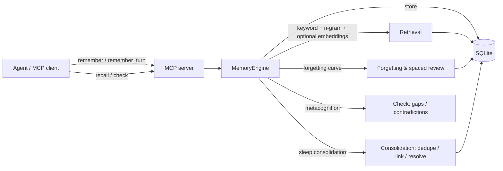

# Mnemosis

> 把 AI 的记忆，从“无限存储 + 搜索”改造成“会记住、会遗忘、会整理、会自我怀疑”的系统。

Mnemosis is a **human-inspired memory layer for AI agents**. Most "AI memory"
systems are just storage with semantic search bolted on: they save everything
and recall by similarity. Mnemosis instead treats memory as a **lifecycle** —
remembering, reinforcing, consolidating, forgetting, and reconciling — the way
human memory actually works.

[](LICENSE)
[](https://github.com/liyexiaoyi/Mnemosis/actions/workflows/ci.yml)
[](https://codespaces.new/liyexiaoyi/Mnemosis)

中文说明：[README.zh-CN.md](README.zh-CN.md) · English: README.md

## Install

```bash
pip install git+https://github.com/liyexiaoyi/Mnemosis.git
```

Zero runtime dependencies (pure Python stdlib + SQLite). No server, no cloud
embeddings required — optional embedder hooks only.

> PyPI 版（`pip install mnemosis`）发布后会在这里同步更新。

SQLite 存储适合单进程/低并发场景；多个 Agent 并发写入时建议串行访问或接入
外部数据库适配层。

## Quick start

```python
from mnemosis import MemoryEngine
from mnemosis.types import MemoryKind, SourceRecord, SourceType

engine = MemoryEngine("memory.db")  # pass a path for persistence

engine.remember(
    "The user prefers Chinese for technical discussions.",
    kind=MemoryKind.SEMANTIC,
    source=SourceRecord(origin=SourceType.USER),
    cues=["user", "language", "preference"],
    importance=0.9,
)

for r in engine.recall("what language does the user prefer?", top_k=3):
    print(f"[{r.item.kind.value}] {r.score:.2f}  {r.item.content}")

check = engine.check("what is the user's favorite movie?")
print("knowledge gaps:", check.gaps or "none")

engine.sleep()  # offline consolidation: dedupe, promote, detect contradictions
```

## 中文快速开始

```bash
pip install git+https://github.com/liyexiaoyi/Mnemosis.git
```

```python
from mnemosis import MemoryEngine
from mnemosis.types import MemoryKind, SourceRecord, SourceType

engine = MemoryEngine("memory.db")
user = SourceRecord(origin=SourceType.USER)

engine.remember(
    "用户喜欢用中文讨论技术问题。",
    kind=MemoryKind.SEMANTIC,
    source=user,
    cues=["语言", "偏好"],
    importance=0.9,
)
engine.remember(
    "昨天一起修了 SQLite 锁死的问题。",
    kind=MemoryKind.EPISODIC,
    source=user,
    cues=["SQLite", "锁死"],
)

for r in engine.recall("用户用什么语言聊天？", top_k=3):
    print(f"[{r.item.kind.value}] 相关度 {r.score:.2f}  {r.item.content}")
```

一分钟完整演示（记住 → 检索 → 新旧矛盾 → 睡眠整合 → 元认知 → 遗忘回收）：

```bash
pip install git+https://github.com/liyexiaoyi/Mnemosis.git
python examples/demo.py          # 仓库内
```

不想安装？可以在线体验：

- [Google Colab 打开演示笔记本](https://colab.research.google.com/github/liyexiaoyi/Mnemosis/blob/main/examples/Mnemosis_demo.ipynb)
  （部分地区访问不了 Colab，可改用下面的方式）
- [GitHub Codespaces 一键打开](https://codespaces.new/liyexiaoyi/Mnemosis)：云端环境，
  打开终端执行 `python examples/demo.py` 即可
- 下载 `examples/Mnemosis_demo.ipynb` 后，用本地 Jupyter 或百度 AI Studio 打开

## How it works

Mnemosis is a **memory layer**, not a recorder: your agent decides what to
save (via `remember` / `remember_turn`) and what to ask (via `recall` /
`check`). Inside, memories are stored, decay, consolidate and self-check the
way human memory does.



**中文原理一句话**：Mnemosis 照着人脑记忆机制给 agent 做长期记忆——`remember`
写入、`recall` 联想检索、遗忘曲线自动衰减、`sleep` 睡眠式整理（去重/建联/消矛盾）、
`check` 知道自己不知道。它不是录音机，谁调用、存什么由你和 agent 决定。

## Use with your AI client (MCP)

One-line MCP integration for Claude Desktop, Cursor, Codex and any MCP client:

```json
{
  "mcpServers": {
    "mnemosis": {
      "command": "mnemosis-mcp",
      "args": ["--db", "/path/to/memory.db"]
    }
  }
}
```

**Windows users**: if the client reports that `mnemosis-mcp` is not found,
add Python's `Scripts` directory to `PATH`, or use an absolute path, e.g.
`"command": "C:\\Users\\you\\AppData\\Local\\Programs\\Python\\Python312\\Scripts\\mnemosis-mcp.exe"`.

Full guide (including Cursor and Codex configs): [`docs/mcp-quickstart.md`](docs/mcp-quickstart.md).

### Remote deployment (HTTP)

The MCP server also speaks Streamable HTTP (POST), so it can run on a VPS or
NAS and be reached from other machines by URL:

```bash
mnemosis-mcp --transport http --host 0.0.0.0 --port 8000 --db /data/memory.db
```

Point an MCP client at `http://your-server:8000/` (Claude Desktop, Cursor and
Cherry Studio accept remote MCP URLs). Put it behind a reverse proxy
(Caddy/nginx) with TLS and basic auth before exposing it to the internet.

Or run it in Docker:

```bash
docker build -t mnemosis .
docker run -d -p 8000:8000 -v mnemosis-data:/data mnemosis
```

Memory is a single SQLite file in `/data`, so backups are just one file.

## Command line

```bash
mnemosis --db memory.db remember "用户喜欢用中文讨论技术问题。" --kind semantic
mnemosis --db memory.db recall "用户喜欢什么语言？"
mnemosis --db memory.db sleep
mnemosis --db memory.db check "用户最喜欢的电影是什么？"
mnemosis mcp --db memory.db   # or: mnemosis-mcp --db memory.db
```

By default the MCP server hides experimental tools from `tools/list`
(they stay callable). Add `--expose experimental` to show all 100+ tools.

### Semantic embeddings (optional)

Without an embedder, recall uses zero-dependency keyword + n-gram matching.
For real semantic recall, point the MCP server at an embedding API:

```bash
# local Ollama (e.g. nomic-embed-text)
mnemosis-mcp --db memory.db --embedder ollama

# any OpenAI-compatible endpoint (DashScope, OpenAI, ...)
export MNEMOSIS_EMBEDDING_API_KEY=sk-...
mnemosis-mcp --db memory.db --embedder openai --embedding-model text-embedding-v3
```

Vectors are cached next to the DB (`memory.db.cache`) and indexed in
`memory.db.vec`, so repeated recalls skip embedding calls.

For the strongest retrieval quality, enable a dense embedder (Ollama or any
OpenAI-compatible endpoint): on the independent LongMemEval benchmark this
mode reaches parity with mem0 on turn recall while keeping ingestion ~13x
faster. Lexical-only mode stays available and is several times faster per
query (dense re-ranking only embeds the top-64 lexical candidates).

After enough usage, call the `calibrate_decay` MCP tool to fit the
forgetting curve to your real retrieval history (median survival span ->
per-user decay rate). The fitted rate is persisted in the SQLite database
and automatically reloaded the next time you open it.

To see what the memory actually holds, call `memory_map` (topics with
counts/retrievability plus a weak/ok/strong histogram), or render a Chinese
chart locally:

```bash
python benchmarks/render_memory_map.py --db memory.db --out memory_map.svg
```

### Automatic memory saving

Mnemosis never eavesdrops: whoever owns the agent decides what is worth
remembering. The easiest automatic pattern is one tool call per turn:

```bash
mnemosis-mcp --db memory.db
```

Then tell your agent in its system prompt:

> After every user/assistant exchange, call `remember_turn` with the raw
> text of the turn. It splits sentences, extracts cues and stores them.
> Call `recall` (or `check`) before answering when the user references
> earlier topics.

`remember_turn` is a single call that stores the whole turn as segmented
memories with automatic cues, so agents do not need to hand-write
`remember` calls for each fact.

### Batch ingestion (importing large histories)

`remember_many` imports a batch of memories with the same per-item
semantics as `remember` (semantic dedupe, cues, term index, association
graph), but commits storage, term rows and links in bulk:

```python
engine.remember_many([
    {"content": "用户喜欢喝咖啡。", "kind": MemoryKind.SEMANTIC, "cues": ["用户"]},
    {"content": "上周修了空调。", "kind": MemoryKind.EPISODIC},
    {"content": "阿丽在2026年3月1日买了笔记本。", "kind": MemoryKind.EPISODIC},
])
```

10,000 memories take about 13 seconds via `remember_many` vs ~70 seconds in
a single-`remember` loop. When a vector index + Ollama/OpenAI embedder is
enabled, embedding is also batched (100 texts per call, chunked by size,
with automatic retry on 429/5xx).

If a batch embedding still fails halfway (the memories are stored but some
have no vector), lexical recall keeps working and the gap can be repaired in
one pass:

```python
rebuilt = engine.rebuild_missing_vectors()   # or the MCP tool rebuild_vectors
```

## Threading

`MemoryEngine` is designed for one agent loop per instance: SQLite access and
the shared intent / suppression state are internally locked, so light
concurrent read/write calls are safe. If you fan one engine out across many
threads, serialize the high-level calls yourself.

## Testing

```bash
python -m unittest discover -s tests -q   # 395 unit tests
python benchmarks/locomo_bench.py --mode keyword   # LoCoMo-style long dialogue
```

## Performance (10,000 memories, local machine)

| Operation | Before | After |
|---|---|---|
| Keyword recall (zero-hit) | 149 ms | 34 ms |
| Fused (keyword + n-gram + RRF) recall | 260 ms | 13 ms |
| N-gram recall | ~200 ms | 5.5 ms |
| Sleep consolidation | 6.0 s | 0.41 s |
| Batch ingestion (`remember_many`, 10k) | ~70 s | 13 s |

On the independent LongMemEval benchmark (20 questions, cloud Qwen
judging), the dense mode matches mem0 on every retrieval metric
(@1 0.5 / @5 0.8 / @10 0.8), scores slightly higher on answer accuracy
(0.45 vs 0.40) and ingests 1.4x faster (44s vs 62s per question).

A larger retrieval-only run (50 questions) confirms exact parity on every
metric (@1 0.42 / @5 0.78 / @10 0.86 / gold-answer-token hit@5 0.38) with
1.37x faster ingestion (44.6s vs 61.2s per question).

The end-to-end run with cloud Qwen judging (30 questions, mem0 vs dense)
again shows identical retrieval (@1 0.433 / @5 0.767 / @10 0.867) and equal
answer accuracy (0.433 both), with 2.1x faster ingestion (28.0s vs 58.8s
per question).

A second cloud-judged sample (different seed, 20 questions, dense mode)
scored 0.6 answer accuracy, so the accuracy range across samples is
~0.43-0.60 (50 combined questions ≈ 0.5), consistent with mem0-tier
retrieval and answer quality.

At a 50k-input / 25k-active real-Chinese store, recall is 26-85ms and
sleep consolidation ~2.3s after the large-store scaling work (batched term
df, batched REM links, generic-cue skipping).

## Independent public benchmark (LongMemEval)

Mnemosis is also validated against an external, non-self-built benchmark:
[LongMemEval](https://github.com/xiaowu0162/LongMemEval) (Wu et al., ICLR 2025),
which uses ~115k tokens of real chat history per question and heavy
interference. The comparison with the official `mem0` package is in
`benchmarks/longmemeval_bench.py`.

First fetch the official dataset (cached copies are detected and reused):

```bash
python benchmarks/fetch_longmemeval.py            # oracle + S set (~290 MB)
python benchmarks/fetch_longmemeval.py --all      # also the 2.7 GB M set
```

If Hugging Face is unreachable from your network, download the files from
`huggingface.co/datasets/xiaowu0162/longmemeval-cleaned` and point the
script at the local folder:

```bash
python benchmarks/fetch_longmemeval.py --source-dir /path/to/downloads
```

Then run a head-to-head against mem0 (requires a Python with `mem0`
installed, plus Ollama or a cloud embedder/LLM for the dense mode):

```bash
python benchmarks/longmemeval_bench.py --data work/longmemeval_s_cleaned.json --questions 20
```

## License

MIT. See [LICENSE](LICENSE).

## Contributing

PRs, issues and new benchmark scenarios are welcome — see
[CONTRIBUTING.md](CONTRIBUTING.md). Every change should come with a test or a
measured benchmark result.
