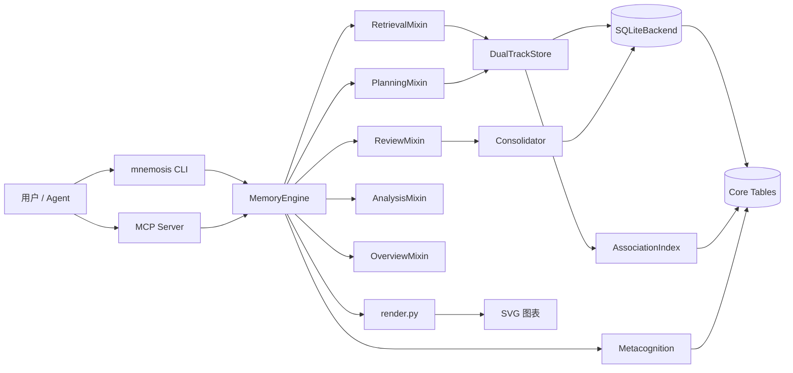

# Architecture

Mnemosis 是一个零依赖的 Python 记忆层：公开入口是 `mnemosis.MemoryEngine`，
其余都是可替换的组件。核心规则是 `stdlib`-only（不引入第三方运行时依赖）。

核心业务模块共 **33 个**（另有 `__init__.py` / `__main__.py` 两个入口文件），
按职责分组如下。

## 模块一览

### 门面与入口

| 模块 | 职责 |
|---|---|
| `engine.py` | `MemoryEngine` 门面：把各 Mixin 和存储组件接在一起，提供 `remember` / `recall` / `sleep` / `update` / `export/import` 等 |
| `cli.py` | `argparse` 命令行：`remember` / `recall` / `memory-map` / `mcp` 等子命令 |
| `mcp_server.py` | 纯 stdlib 的 stdio MCP 服务器（JSON-RPC 2.0），用 `@_tool` 注册表把引擎暴露成 100+ 工具 |

### 记忆模型与编码

| 模块 | 职责 |
|---|---|
| `types.py` | 核心数据模型：`MemoryItem`、`SourceRecord`、`MemoryKind`、`RecallResult`、分词与线索提取 |
| `zh_nlp.py` | 中文同义词扩展与 CJK 检测 |
| `embedding.py` | 零依赖 `NGramEmbedder` + 外部向量接口 `CallableEmbedder` |
| `embedding_cache.py` | 向量缓存（按内容哈希 + 字节预算淘汰） |
| `vector_index.py` | 可选向量索引（近似检索） |

### 检索与推理

| 模块 | 职责 |
|---|---|
| `retrieval_mixin.py` | 检索入口：候选打分、图后处理、强化、错误追踪 |
| `hybrid.py` | 混合检索：词法 + 向量融合（`recall_fused`） |
| `temporal_reason.py` | 时间/时序推理（日期解析、事件链顺序） |
| `reasoning.py` | 推理辅助（步进回忆、归因等） |

### 双轨存储与遗忘

| 模块 | 职责 |
|---|---|
| `schema.py` | 数据库 schema 常量（SQL 片段） |
| `backend.py` | 存储抽象：`DictBackend`（测试/内存）和 `SQLiteBackend`（持久化，WAL、批量导入临时表暂存、无向边规范存储） |
| `dual_track.py` | 情景/语义双轨：编码、upsert 去重、recall 主链路 |
| `association.py` | 线索索引 + 关联图（增量构建用尾部扫描，桶内按 seq 有序） |
| `forgetting.py` | 遗忘曲线（指数衰减）、访问强化、间隔复习调度 |
| `importance.py` | 规则式重要性打分（可挂 LLM scorer） |
| `recycle.py` | 软删除回收站（restore / purge） |
| `consolidation.py` | 离线“睡眠”：提升、修剪、去重、REM 关联强化、冲突消解、弱回忆重放、情绪巩固、同化 |

### 能力 Mixin（挂在 `MemoryEngine` 上）

| 模块 | 职责 |
|---|---|
| `planning_mixin.py` | Agent 规划：目标拆解、步骤记忆、意图注册与冲突 |
| `review_mixin.py` | 间隔复习：到期计划、练习反馈、睡眠后预热 |
| `learning_mixin.py` | 学习会话：目标设定、练习记录、掌握度统计 |
| `snapshot_mixin.py` | 记忆快照与检索辅助：阶段性导出、上下文补全 |
| `practice_mixin.py` | 练习计划与掌握度：预测下次复习效果 |
| `consolidation_insights_mixin.py` | 巩固/睡眠洞察：睡眠收益、去重、元认知报告 |
| `narrative_mixin.py` | 叙事与冲突报告：事件故事线、新旧矛盾分析 |
| `affective_mixin.py` | 情绪侧报告：情绪建议、睡眠推断、情绪记忆分析 |
| `cognitive_mixin.py` | 认知策略：反刍检查、注意力过滤、类比桥接、夜间例程、目标进展 |
| `overview_mixin.py` | 概况画像：记忆健康评分、记忆地图、知识图谱导出、学习者画像、上下文打包、编码质量 |
### 分析与元认知

| 模块 | 职责 |
|---|---|
| `analysis_mixin.py` | 剩余分析报告：解释记忆、对比、多跳报告、遗忘报告、检索质量、回忆轨迹、社区/相似度/关联报告 |
| `metacognition.py` | 置信度标签、矛盾报告、知识缺口 |

### 工具与渲染

| 模块 | 职责 |
|---|---|
| `render.py` | 纯 stdlib SVG 渲染（记忆地图图表） |

## 架构图



## 数据流

### 写入

```text
remember(content, kind, source, cues, ...)
  -> 分词一次（提取线索 + 词条共用）
  -> MemoryItem（哈希、时间戳、strength=1.0）
  -> DualTrackStore：情景 INSERT / 语义按 (kind, content_hash) 去重合并
  -> AssociationIndex：登记线索桶、选 top-k 关联边（规范方向一行）

批量导入（remember_many_chunked）
  -> bulk mode：临时表暂存 terms/links（代码运行时动态创建的 TEMP TABLE），
     结束时一次排序拷入
  -> 读侧索引延迟到结束重建，崩溃后启动自愈
```

### 检索

```text
recall(query)
  -> 分词/同义词扩展 -> 词频决定候选 -> 主键索引取候选
  -> 打分：关键词重叠 + 重要度 + 遗忘曲线 + 情境/情绪/置信度/源可信度…
  -> 可选向量重排（默认 top-64 候选，可配置）
  -> 图后处理：关联激活、模式补全、竞争抑制
  -> 强化命中、记录失败、安排复习
```

### 睡眠

```text
sleep()
  -> 回放最近窗口 -> 合并近重复 -> 提升情景为语义 -> 修剪噪音
  -> 弱回忆重放 -> 冲突检测 -> REM 共享线索加链（双桶交集快路径）
  -> 情绪巩固 -> 同化 -> 可选 LLM 反思
  -> 睡眠后后台预热（按重要度+遗忘压力+近期热度选线索）
```

### 检查

```text
check(query)
  -> Metacognition：置信度标签、知识缺口、未决矛盾
```

## 存储 Schema（SQLite）

```sql
CREATE TABLE memories (
  id TEXT PRIMARY KEY, kind TEXT, content TEXT, content_hash TEXT,
  source_json TEXT, cues_json TEXT, created_at TEXT, last_access_at TEXT,
  access_count INTEGER, importance REAL, strength REAL, confidence REAL,
  status TEXT, seq INTEGER NOT NULL DEFAULT 0, context TEXT, affect TEXT,
  evidence_count INTEGER, storage_strength REAL, updated_at TEXT,
  revision_count INTEGER, last_review_at TEXT, review_streak INTEGER,
  retrieval_successes INTEGER, retrieval_failures INTEGER
);

CREATE TABLE links (
  src TEXT, dst TEXT, weight REAL, PRIMARY KEY (src, dst)
);
  -- 无向关联边，只存规范方向一行 (min,max)；方向由应用层规范化
CREATE TABLE terms (
  term TEXT, memory_id TEXT, kind TEXT, PRIMARY KEY (term, memory_id)
);
CREATE TABLE cues (
  cue TEXT, memory_id TEXT, PRIMARY KEY (cue, memory_id)
);
CREATE TABLE settings (
  key TEXT PRIMARY KEY, value TEXT
);

CREATE INDEX idx_memories_seq ON memories(seq);
CREATE INDEX idx_memories_kind ON memories(kind);
CREATE INDEX idx_memories_status ON memories(status);
CREATE INDEX idx_memories_status_kind ON memories(status, kind);
CREATE INDEX idx_memories_status_seq ON memories(status, seq);
CREATE INDEX idx_memories_status_importance ON memories(status, importance);
CREATE UNIQUE INDEX idx_semantic_hash ON memories(kind, content_hash)
  WHERE kind = 'semantic';
CREATE INDEX idx_links_dst ON links(dst);
CREATE INDEX idx_terms_memory ON terms(memory_id);
CREATE INDEX idx_cues_memory ON cues(memory_id);
```

要点：

- 语义记忆按 `(kind, content_hash)` 唯一去重；`seq` 是全局自增序号（有索引，
  批量导入每分块 `MAX(seq)` 走索引）；
- `seq` 由引擎层用 `SELECT MAX(seq) + 1` 在应用内显式分配（配合
  `BEGIN IMMEDIATE` 防并发重号），不依赖数据库自增；
- 关联边是**无向**的：旧库首次打开会自动把双向行迁移合并为规范方向；
- 批量导入把 `terms`/`links` 先写进临时表，结束时按主键顺序一次拷入，
  期间延迟重建 8 个非必需索引（5 个 memories 读侧 + `idx_links_dst` +
  `idx_terms_memory` + `idx_cues_memory`）；崩溃后 `_ensure_runtime_state`
  自愈全部 9 个索引（上述 8 个 + `idx_memories_seq`）。`idx_semantic_hash`
  与 `idx_memories_seq` 在导入期间保留（语义去重和序号分配需要）。
- `links` 的出边（按 src）查询直接走主键索引（src 是 PK 首列），因此只需
  补 `idx_links_dst` 覆盖入边方向。

## 设计规则

1. **零运行时依赖**：核心只依赖标准库；向量/LLM 都是可选回调。
2. **默认确定**：评分无隐藏随机性；固定种子可复现（CLI、基准、CI 门禁）。
3. **可插拔**：embedder、scorer、summarizer 都是可选接口，缺省也能跑。
4. **不静默删除**：遗忘都走回收站，`purge` 才是真正删除。
5. **扩展性有护栏**：CI 有 18 项回归（含关联图快照、词条指纹、全链路端到端）；
   官方基准见 [scalability.md](scalability.md)。
